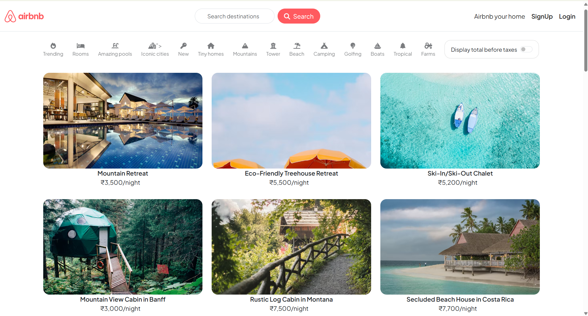

# 🏡 Airbnb Full Stack Deployed Project

A full-stack Airbnb-inspired accommodation rental platform built using Node.js, Express.js, MongoDB, EJS, and Bootstrap. The application implements core functionality of a property-booking platform, including secure user authentication, property management, reviews, and interactive map integration.

The project follows the MVC (Model-View-Controller) architecture to maintain a clean separation of concerns and make the application easier to develop, maintain, and scale.

## 📌 Project Overview

This project is a simplified implementation of an Airbnb-style platform where users can discover properties, create their own listings, and interact with the platform through reviews.

The application demonstrates practical implementation of:
  - Full-stack web development
  - RESTful routing
  - MVC architecture
  - User authentication and authorization
  - CRUD operations
  - MongoDB database management
  - Server-side rendering with EJS
  - Image and location-based property management
  - Mapbox integration for interactive maps and property locations
  - Form validation and error handling
  - Cloud deployment

## 🖥️ Application Preview

## ✨ Features
- **User Authentication:**
  - Sign up, login, and logout functionality.
  - Password hashing for secure credential storage.
  - Authentication middleware and Session management.

- **Property Listings:**
  - Add, edit, and delete properties.
  - View a list of all available properties with detailed descriptions.
  - Store property information in MongoDB.
  - Display property location using Mapbox.

- **Reviews:**
  - Add new reviews for properties.
  - Edit, view and delete existing reviews.
  - Rating-based feedback.
  - Associate reviews with specific listings.
  - Authorization for review modification.

- **Map Integration:**
  - Display property location.
  - Location-based visualization.
  - Integration with listing data.
  - Interactive map interface.

## 🏗️ Architecture

The application follows the MVC (Model-View-Controller) architectural pattern:

                          ┌──────────────────────────┐
                         │          CLIENT          │
                         │      Browser / User      │
                         └────────────┬─────────────┘
                                      │
                                      │ HTTP Request
                                      ▼
                         ┌──────────────────────────┐
                         │     EXPRESS ROUTES       │
                         │     Request Routing      │
                         │                          │
                         │  /listings               │
                         │  /reviews                │
                         │  /users                  │
                         └────────────┬─────────────┘
                                      │
                                      ▼
                         ┌──────────────────────────┐
                         │       CONTROLLERS        │
                         │      Business Logic      │
                         │                          │
                         │ Listing / Review /       │
                         │ User Operations          │
                         └──────┬───────────┬───────┘
                                │           │
                       ┌────────┘           └────────┐
                       ▼                             ▼
              ┌──────────────────┐          ┌──────────────────┐
              │      MODELS      │          │       VIEWS      │
              │     Mongoose     │          │       EJS        │
              │                  │          │                  │
              │ Schema & Data    │          │ Server-side      │
              │ Validation       │          │ Rendering        │
              └────────┬─────────┘          └────────┬─────────┘
                       │                             │
                       ▼                             ▼
              ┌──────────────────┐          ┌──────────────────┐
              │     MONGODB      │          │     BOOTSTRAP    │
              │     DATABASE     │          │        UI        │
              │                  │          │                  │
              │ Users            │          │ Responsive       │
              │ Listings         │          │ Interface        │
              │ Reviews          │          │                  │
              └──────────────────┘          └────────┬─────────┘
                                                     │
                                                     │ map.js
                                                     ▼
                                            ┌──────────────────┐
                                            │     MAPBOX API   │
                                            │ Third-Party      │
                                            │ Service          │
                                            │                  │
                                            │ Property         │
                                            │ Location & Maps  │
                                            └──────────────────┘

## MVC Components

### Model

Responsible for:
  - Database schemas and data structure
  - Data validation
  - Database operations using Mongoose
  - Managing relationships between users, listings, and reviews
  - Communicating with MongoDB

### View

Responsible for:
  - EJS templates
  - Server-side page rendering
  - Forms and user interactions
  - User interface structure
  - Responsive styling using Bootstrap
  - Displaying data received from controllers

### Controller

Responsible for:
  - Application and business logic
  - Processing incoming requests
  - Handling CRUD operations
  - Authentication and authorization logic
  - Communicating with models
  - Preparing data for views
  - Managing redirects and HTTP responses

## 🛠️ Technology Stack

| Category | Technologies |
|----------|--------------|
| **Runtime** | Node.js |
| **Backend Framework** | Express.js |
| **Frontend / Templating** | EJS |
| **CSS Framework** | Bootstrap |
| **Database** | MongoDB |
| **ODM** | Mongoose |
| **Authentication** | Passport.js + Passport-Local |
| **Maps** | Mapbox |
| **Architecture** | MVC |
| **Deployment** | Render |
| **Version Control** | Git & GitHub |
 
## 🚀 Live demo
Link: https://airbnb-major-project-devaryan.onrender.com

**Note:** The application is deployed on Render. If the service has been inactive for some time, the first request may take a few seconds to load.

---

## 🤝 Connect with Me

**Aryan Raj**

Data Scientist | AI Engineer | Software Developer

- 🌐 GitHub: https://github.com/aryanraj7791
- 💼 LinkedIn: https://www.linkedin.com/in/aryan-raj-79246b280/
- 📧 Email: aryanraj5371@gmail.com

⭐ If this project helped you, please star the repository!